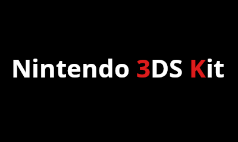

Nintendo 3DS Kit es un script construido a partir de GodMode9, el explorador avanzado de Nintendo 3DS que se ejecuta a través de un payload por Arm9LoaderHax, SigHax o NtrBootHax. 

Al igual que GodMode9, los requisitos para construir este script son:  
-Python 3.8.5 y Pip3 (ambos en el $PATH y accesibles) 
-FirmTool (Tambien debe estar en el $PATH) 
-devkitARM (es un paquete que forma parte de devkitpro-Pacman, debe estar tambien en el $PATH)  
export DEVKITARM=/opt/devkitpro/devkitARM 
-arm-none-eabi-gcc, cmake y curl (de los que depende devkitpro y GodMode9)

La mejor forma de compilar el script es usando git, descargar este repositorio con  
git clone https://github.com/daviiid99/Nintendo-3DS-Kit.git

Para descargar git, puedes hacerlo con sudo apt-get install git (en Linux)
   

Una vez descargado el repositorio y descomprimido su contenido, abre un ventana de terminal en la raíz del directorio y construye el script con  
make SCRIPT_RUNNER=1   El script compilado se encontrará en la ruta /output.
