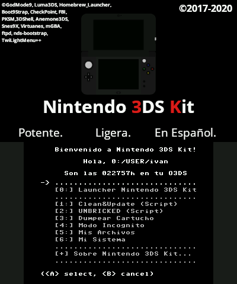

Nintendo 3DS Kit es un script construido a partir de GodMode9, el explorador avanzado de Nintendo 3DS que se ejecuta a través de un payload por Arm9LoaderHax, SigHax o NtrBootHax. 

<br/>

# Instalación Nintendo 3DS Kit

Para ejecutar el script, necesitas una Nintendo 3DS que actualmente esté ejecutando un exploit reciente, ya sea SigHax o NtrBootHax.

Si cuentas con uno de esos exploits, simplemente debes descargar la última release <b><a href="https://github.com/daviiid99/Nintendo-3DS-Kit/releases">Aquí</a></b>

Descomprime el archivo <b>Nintendo3DSKit-[date]-RELEASE.zip</b> en la raíz de tu SD y se ejecutará automáticamente el <b>boot.firm</b>; si cuentas con SigHax o el <b>ntrboot.firm</b>; si usas NtrBootHax.
<br/>
<br/>

# Características Nintendo 3DS Kit

```
Instalador de SigHax a través de Boot9Strap o fastboot3ds
```
```
Instalador de .CIA/.NDS a través de un explorador de la SD
```
```
Actualizador offline y multi-consolade SigHax y archivos del CFW
```
```
Dumpeador de títulos en cartuchos físiscos de Nintendo DS o Nintendo 3DS
```
```
Actualizador de la NAND a través de herramientas de transferencia o backup
```
```
Modificador de títulos del sistema
```
```
Dumpeador de títulos del sistema
```
```
Lanzador de payloads en formato .firm
```
```
Restaurador de archivos de la NAND virtual
```
```
Limpiador de la Tarjeta SD
```
```
Otras funciones menos relevantes
```
